# 05. App Architecture

## 01. Architecting on the Fly

집 설계에 대비하여 설명 : 설계는 중요하다 

## 02. Lesson Introduction

학습 목표

- Andorid Architecture

- ViewModel

- LifeCycle

- Data Binding

안드로이드 아키텍쳐를 배워서 협업 등 이점을 배우자.

라이프사이클 라이브러리를 이용하여 메모리 누수나 회전 등 문제를 해결하자.

DataBinding을 이용하여 bunch of boilerplate 코드를 제거하자

## 03. Exercise: Tour of the App

guess the word 게임 앱을 개발할 것

화면 구조

- Activity

- ScoreFragment

- GameFragment

- TitleFragment

## 04. Where the App Falls Short

회전시 화면이 재구성되면서 데이터가 초기화되었다.

일반적으로 onSaveInstanceState가 사용되지만 lifecycle 라이브러리를 사용하겠다.

## 05. What is Architecture

you're gonna be learning about a single multi-purpose achitecture pattern that we're gonna build on for the rest of this course 

MVVM

officially endorsed by google

leverages the lifecycle classes

Reference documentation

- [Code Sample - Android Architecture Blueprints](https://github.com/googlesamples/android-architecture)
- [Code Sample - Blueprint Architecture Samples at a Glance Comparison](https://github.com/googlesamples/android-architecture/wiki/Samples-at-a-glance)
- [Talk - Android Jetpack: what's new in Architecture Components (Google I/O '18)](https://www.youtube.com/watch?v=pErTyQpA390)
- [Talk - Droidcon NYC 2016 - A Journey Through MV Wonderland](https://www.youtube.com/watch?v=QrbhPcbZv0I)
- [Blog Post - Android Architecture Patterns Part 2: Model-View-Presenter](https://medium.com/upday-devs/android-architecture-patterns-part-2-model-view-presenter-8a6faaae14a5)
- [Documentation - Guide to App Architecture](https://developer.android.com/jetpack/docs/guide)
- [Blog Post - Android and Architecture](https://android-developers.googleblog.com/2017/05/android-and-architecture.html)

## 06. Our App Architecture

UI Controller(Activity / Fragment)

화면으로 데이터를 제공하고 사용자의 입력을 받음

ViewModel

데이터를 보존하고 준비함

liveData를 포함함

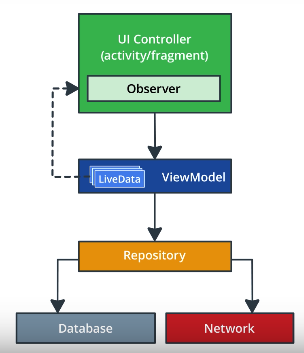

## 07. ViewModel

기존 코드와 뷰모델의 차이를 보여줌.

화면이 재생성되면서 데이터를 잃지만 ViewModel을 통하여 이전 데이터를 다시 조회할 수 있음. 

[ViewModel의 장점]

- lifecycle을 신경 쓸 필요가 없다.
- 번들로 savedInstance 함수에서 뷰의 상태가 바뀔 때 데이터를 주고 받았는데 번들에는 사이즈 제한이 있다. (ViewModel은 자유로움) - ViewModel 에서도 Bundle 사용 (주의 필요)

[ViewModel의 단점] 

- 영구적인 데이터로는 쓸 수 없다. ⇒ 6강에 나오는 Room 등을 사용하여 해결

## 08.Exercise: Create the GameViewModel

실습 순서

1. Dependency 추가

 2.  Subclass ViewModel 생성

 3. UI Controller와 ViewModel의 연결

- Fragment가 완전히 쓰이지 않는다고 표시 될 때 ViewModel이 해제가 된다.

## 09.What Belongs in the GameViewModel?

- The ViewModel is a stable place to store the data to display in the associated UI controller.
- The Fragment draws the data on screen and captures input events. It should not decide what to display on screen or process what happens during an input event.
- The ViewModel never contains references to activities, fragments, or views.

## 10. Exercise: Populate the GameViewModel

데이터 변수와 데이터 처리 함수를 ViewModel로 옮기는 처리

규칙

- ViewModel서 Data를 보존할것
- UI Controller는 디스플레이나 사용자/OS의 이벤트를 받아오는 역할만 할것
- UI Controller에서 의사결정을 하지 않을 것
- ViewModel에서 Activity나 Fragment를 참조하지 말것.

    → 적어도 Memory Leak이나 기타 오류가 발생됨

? Android API 중에 context를 요하는 작업은 ViewModel에서 어떻게 진행할 것인가 ?

## 11. The Benefits of a Good Architecture

관심사 분리로 인한 장점

1. Organized

    관리나 디버깅이 쉽도록 구조화됨

2. Easier to debug

    lifecycle에 대한 문제나 버그가 줄어듬
    일관된 아키텍처로 디버깅이 쉬워짐

약한 결합에 의한 장점

1. Fewer Lifecycle issues

    Lifecycle로 인한 문제가 적어짐

2. Modular

    다른곳에서 사용하거나 교체하기 용의

3. testable

    테스트 작성이 쉽다.

    가볍다.
    종속성을 제거하여 만든 아키텍처는 테스트 코드를 작성하기 용이하다.

## 12. The Power and Limits of the ViewModel

Options for preserving UI state

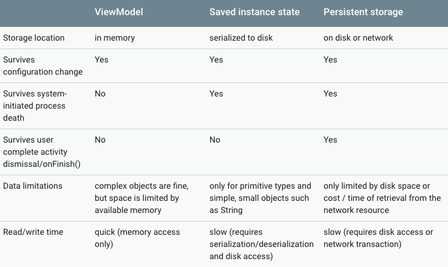

ViewModel 3가지 제한사항

(LiveData가 도와줄 문제들 ㅎㅎ)

1. 데이터가 In Memory로서 백그라운드에서 제거될 수 있음.
2. UI와 VM의 중복되는 함수 발생하며 순서가 어려워짐
3. ViewModel에서 View를 업데이트 할 수 없음

## 13.LiveData

Observer 패턴으로 구현되어 구독 가능한 Data Holder calss

? LiveData는 InMemory인가 saved instance state 인가 Persistant storage인가 ?

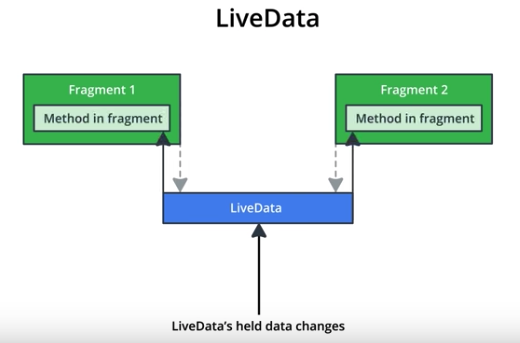

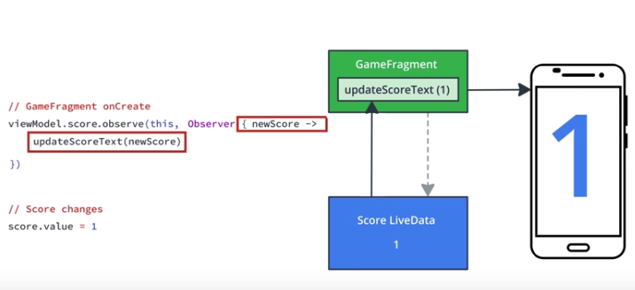

## 14. Exercise: Add LiveData to GameViewModel

LiveData의 사용 실습

1. ViewModel의 변수를 LiveData로 변경

        //As-Is
        val scroe = 5
        //To-Be
        val scroe = MutableLiveData<Int>()

- 팁1. LiveData는 Nullable로서 아래와 같이 방어코드 작성

        score.value = (score.value)?.minus(1)

2. UIController에서 ViewModel의 변수를 구독하고 화면 갱신 처리

    viewModel.score.observe(this, Observer{ newScore ->
    	binding.scoreText.text = viewModel.score.toString()
    })

## 15.Lifecycle Awareness

LiveData는 UI controller의 Lifecycle을 인식하고 있다.

1. UI Contoller가 백그라운드로 가면 update하지 않는다.

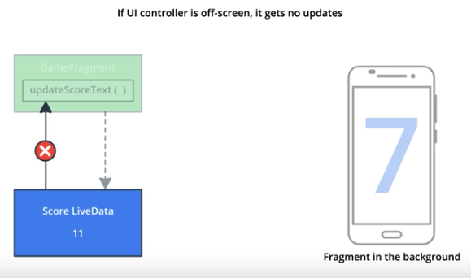

2. UI Controller가 포그라운드로 되돌아오면 현재 값을 전달한다.

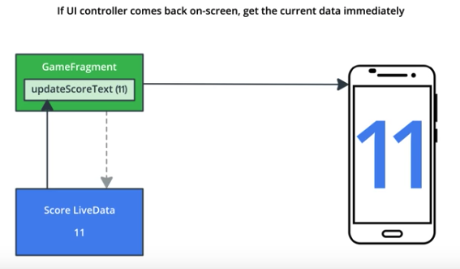

3. 새로운 UI Controller에서 Observe시 현재 값을 전달한다.

4. UI Controller가 Destroy되면 구독을 삭제한다.

## 16. Exercise: Add LiveData Encapsulation to GameViewModel

LiveData의 캡슐화

내부 로직에서만 변경되는 값이라면 수정을 제한하여 조회만 가능하게 하는 등

다음과 같이 UI의 로직 변경 없이 캡슐화 가능

    // As-Is
    val score = MutableLiveData<Int>()
    
    // To-Be
    private val _score = MutableLiveData<Int>()
    val score : LiveData<Int>
    	get() = _score

자바에서는 MutableLiveData는 private로 만들고 그 getter를 LiveData를 리턴하는 public method로 만듬으로써 캡슐화가 가능하다.

- 안드로이드의 스타일 가이드를 따라보자.

    [Kotlin style guide | Android Developers](https://developer.android.com/kotlin/style-guide)

## 17. Event vs. State

상태와 이벤트의 구분

Event

A notification

A sound playing when a button is pressed

Navigationg to a different screen

State

A loading Indicator

The most recent email received

## 18. Exercise: Add End Game Event

게임 종료 이벤트를 추가함

게임 종료 후 화면 회전 등으로 인해 중복 이벤트를 받을 수 있음

게임 종료 중복실행 될 수 있으므로 observe 받은 후 화면에서 확인 한 event를 추가하여 처리

## 19. Google Interview: Yigit Boyar

AAC Tech Lead 잇 님의 인터뷰 

안드로이드 개발을 시작하려면 뭐부터 해야될까요

문서만으로는 부족한게 많을 수 있다. 많은 사람들의 Usecace를 보고 왜 그렇게 했는지 이해하고 너의 제품에 적용해 봐라.

초기 목표가 뭐였나요

우리는 항상 개발할때 나타나는 문제점 파악하여 개선하는 것이었다. 개발자의 요구사항을 반영하는 것들? 기존 API는 10년도 더됐기 때문에.

왜 Lifecycle 라이브러리를 만들게 되었나요

가장 중요한 부분이 라이프사이클인데 복잡하여 많은 개발자들이 나중에 볼때 어렵다. 이 부분을 관리해주고싶어서!

Lifecycle 라이브러리의 다음 목표가 뭔가요.

가장 어려운 부분은 각 아키텍처 컴포넌트의 각기 다른 라이프사이클이다. 비슷해보이지만 각기 다르다. 각 차이가 고민되지 않도록 단순하게 만드는것이다.

? 실제 AAC를 사용하며 문제가 있나보다 ?

## 20. Adding a Timer

타이머를 추가할것이다.

타이머는 ViewModel에 두어 화면의 상태와 관계없이 카운팅 되도록 할것.

## 21. Exercise: Add CountDownTimer

CountDownTimer를 이용하여 시간을 카운팅

currentTime 변수를 이용하여 화면업데이트

카운트 종료시 게임 종료 처리

## 22. Exercise: Add a ViewModelFactory

* ViewModel에 초기값 넣어주는 2가지 방법
- ViewModelFactory를 활용하여 생성자 넣어주기
- Setter를 이용하여 값 넣어주기 

* ViewModelFactory를 만들어서 ViewModel에 초기화 값을 넣어서 객체 생성 할 수 있도록 만드는 방법

    // As-Is
    scoreViewModel = ViewModelProviders.of(this).get(ScoreViewModel::class.java)
    // To-Be
    viewModelFactory = ScoreViewModelFactory(score)
    scoreViewModel = ViewModelProviders.of(this, viewModelFactory).get(ScoreViewModel::class.java)
 => ?? ViewModelFactory에 Generic을 사용하여 BaseViewModelFactory를 만들 수 있는지 확인 필요

## 23. Exercise: Add ViewModel to Data Binding

databinig과 ViewModel의 연결

As-Is

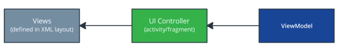

To-Be

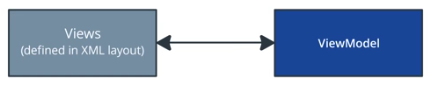

1. Layout에 binding 정보 추가

    <data>
        <variable
            name="gameViewModel"
            type="com.example.android.guesstheword.screens.game.GameViewModel" />
    </data>

2. UI ClickListener의 ViewModel의 함수 호출을 layout으로 이관

    android:onClick="@{() -> gameViewModel.onSkip()}"

## 24. Exercise: Add LiveData Data Binding

databinding과 livedata의 연결

As-Is

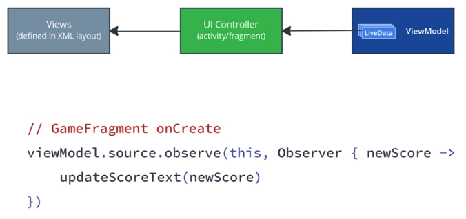

To-Be

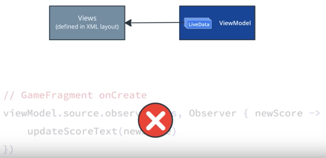

UI에서 ViewModel을 binding시 setLifecycleOwner를 추가적으로 호출해준다.
setLifecycleOwner를 사용하면 LiveData를 observe 할 필요 없이 postValue를 통해 뷰가 자동으로 갱신된다.

    binding.gameViewModel = viewModel
    binding.setLifecycleOwner(this)

Layout에서 다음과 같이 매핑

    android:text="@{gameViewModel.word}"
    
    //Tip - String resource를 사용하여 포멧 가능
    <string name="quote_format">\"%s\"</string>
    android:text="@{@string/quote_format(gameViewModel.word)}"

## 25.Exercise: LiveData Map Transformation

LiveDate의 흐름을 구현할 수 있다.

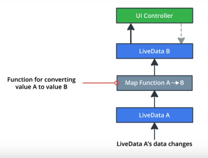

    val currentTime = MutableLiveData<Long>()
    
    val currentTimeString = Transformations.map(currentTime) { time ->
        DateUtils.formatElapsedTime(time)
    }
* Transformations.map : LiveData에서 새로운 LiveData로 변형하여 값을 가져오기 위한 방법

## 26. Optional Exercise: Adding the Buzzer

각 동작에 진동을 발생할 Buzzer 이벤트를 추가해보자.

## 27. Recap of Architecture and Lifecycles

1. Architecture
2. ViewHolder
3. LiveData
4. DataBinding
