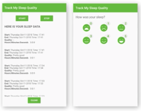
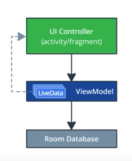
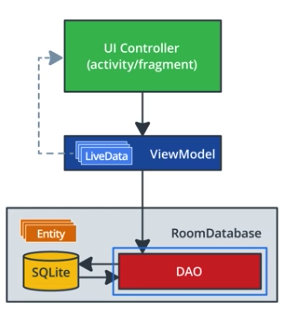

# 06. App Acritecture(Persistence)

## 01. Wake Up, Aleks!

이번 강좌에 사용할 수면 패턴 기록앱 테스트중이었다. 상황극..

## 02. Introduction

개발할 앱 화면(수면 시간 / 수면 품질 기록)

아키텍처

학습 목표

Room Database

DAO

Application Architecture with Room

Coroutines

## 03. SQLite Primer

다음 주제에 대한 간략적인 설명

SQL databases

SQLite

Query language

Query structure

## 04. Designing Entities

## 05. Exercise: Creating the SleepNight Entity

Entity

entity class는 테이블이고, instance는 데이터이다.

기본 room Annotation 구현 및 설명

    @Entity(tableName = "daily_sleep_quality_table")
    data class SleepNight(
        @PrimaryKey(autoGenerate = true)
        var nightId: Long = 0L,
    
        @ColumnInfo(name = "start_time_milli")
        val startTimeMilli: Long = System.currentTimeMillis(),
    
        @ColumnInfo(name = "end_time_milli")
        var endTimeMilli: Long = startTimeMilli,
    
        @ColumnInfo(name = "quality_rating")
        var sleepQuality: Int = -1
    )

기타 Annotation 참고

[Defining data using Room entities | Android Developers](https://developer.android.com/training/data-storage/room/defining-data.html)

## 06. Data Access Object (DAO)

## 07. Exercise: DAO - SleepDatabaseDao

DAO Annotation

@Dao

    @Dao
    interface SleepDatabaseDao{
    
    	@Insert
    	fun insert(night: SleepNight)
    	
    	@Update
    	fun update(night: SleepNight)
    
    	@Delete
    	fun delete(night: SleepNight)
    
    	@Query
    	fun get(key: Long): SleepNight?
    	
    	@Query("SELECT * from daily_sleep_quality_table WHERE nightId = :key")
    	fun get(key: Long): SleepNight?
    
    	@Query("DELETE FROM daily_sleep_quality_table")
    	fun clear()
    
    	@Query("SELECT * FROM daily_sleep_quality_table ORDER BY nightId DESC")
    	fun getAllNights(): LiveData<List<SleepNight>>

Tip - Android Studio Compiler가 syntax 에러를 잡아주는구나?

? LiveData로 반환할 경우 Room에서 계속 업데이트 해주며, observer를 지정해 줄 필요가 없다.?!!

Room Persistence Library

[Save data in a local database using Room | Android Developers](https://developer.android.com/training/data-storage/room/index.html)

 

## 08. Creating a Room Database

## 09. Exercise: Creating a Room Database

Database 생성 순서

1. Extend RoomDatabase
2. Create Database
3. Associate with DAO
4. Get Reference to Database

    
    @Database(entities = [SleepNight::class], version = 1, exportSchema = false)
    abstract class SleepDatabase : RoomDatabase() {
    
    // 기타 테이블 추가 가능
    abstract val sleepDatabaseDao: SleepDatabaseDao
    
    companion object {
    
    		// Database Connection은 비용이 크기 때문에 싱클턴으로 관리
    		// volatile - 초기화 여부를 판단하고 synchronized 블록에 진입
        @Volatile
        private var INSTANCE: SleepDatabase? = null
    
        fun getInstance(context: Context): SleepDatabase {
            synchronized(this) {
                var instance = INSTANCE
    
                if (instance == null) {
                    instance = Room.databaseBuilder(
                            context.applicationContext,
                            SleepDatabase::class.java,
                            "sleep_history_database"
                    )
                            .fallbackToDestructiveMigration()
    												// 데이터베이스의 스키마가 변경될때.
    												// 기존 데이터를 마이그레이션 해줌.
                            .build()
                    INSTANCE = instance
                }
                return instance
            }
         }
      }
    }
