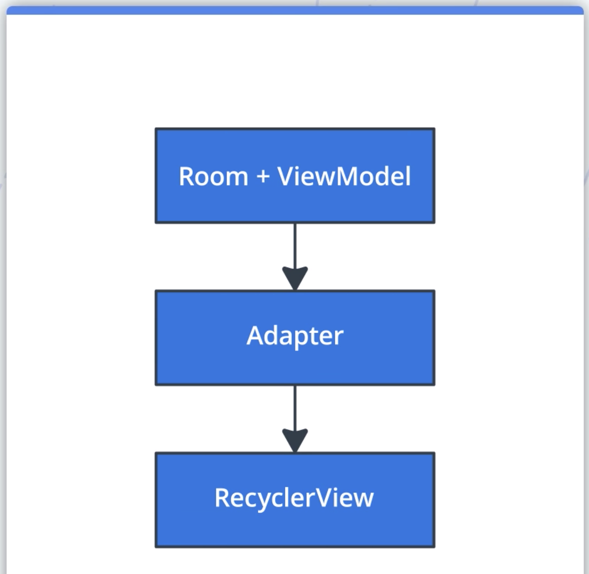
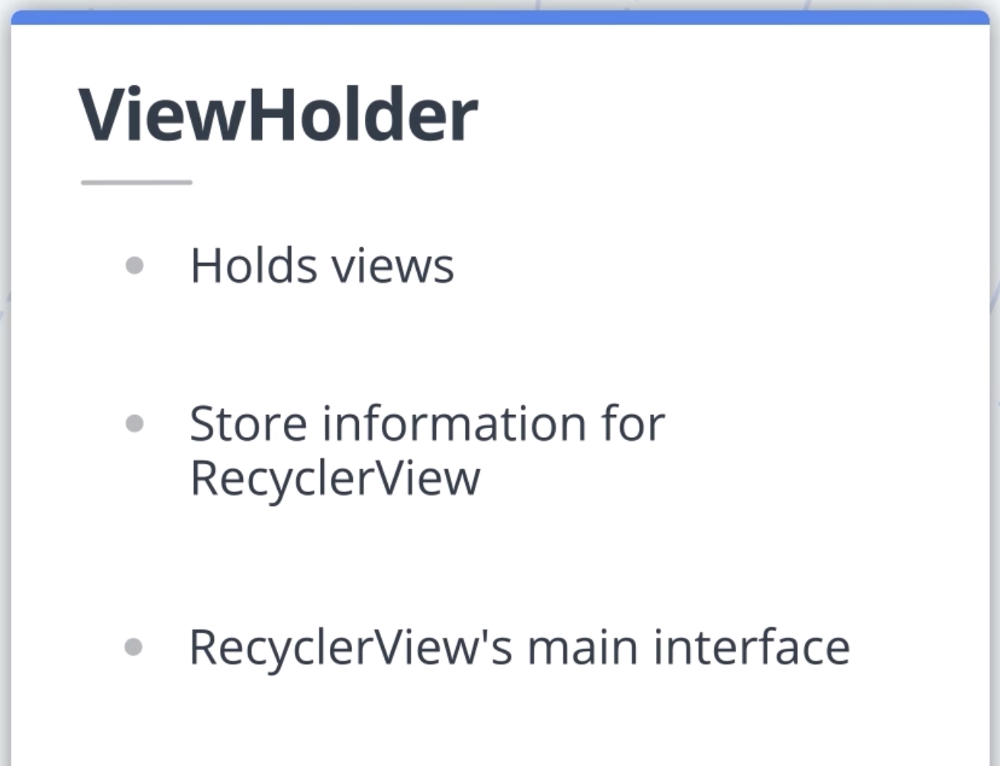
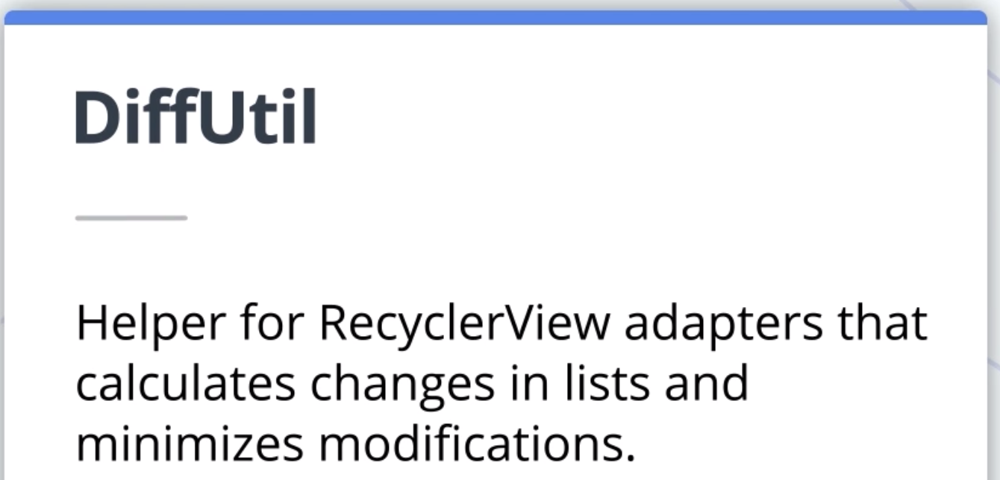
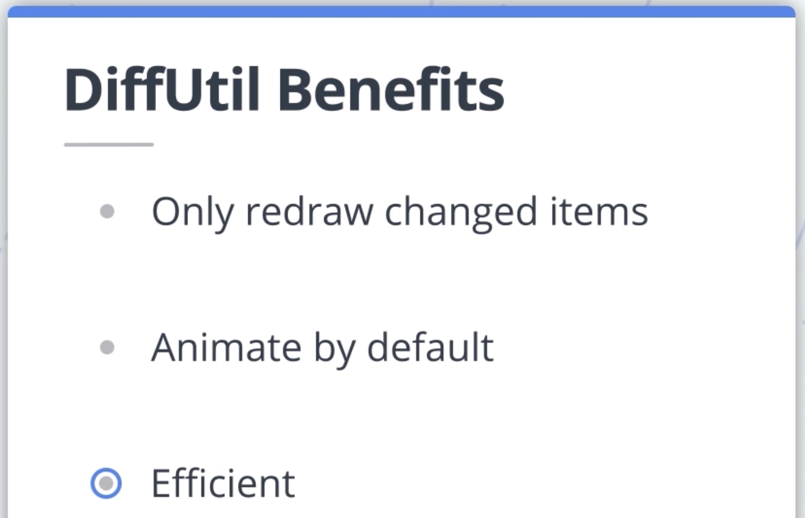
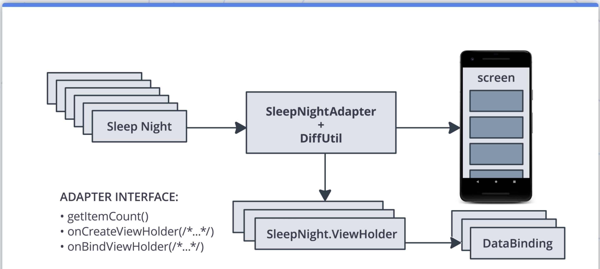
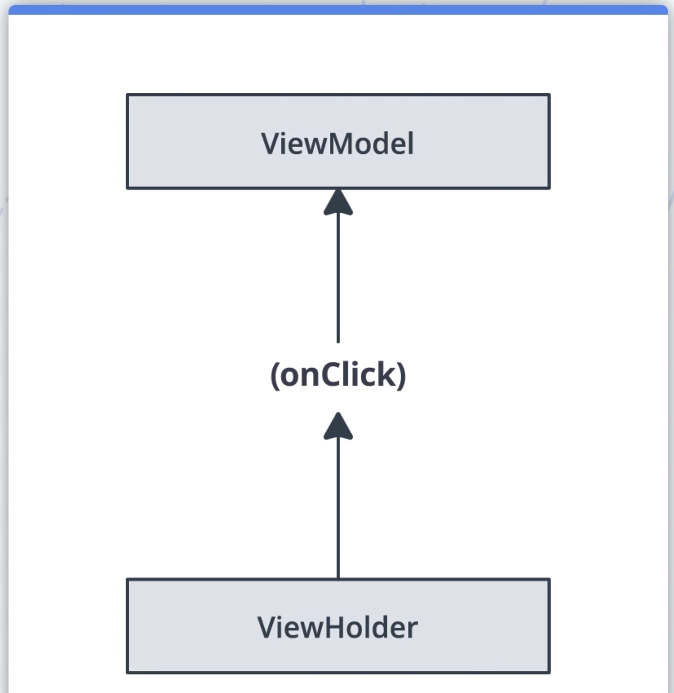

# RecyclerView

---

## 1. Recycle Woman

## 2. Introduction

## 3. Your first RecyclerView

Room+ViewModel과 Adapter의 연결 구조

ViewHolder의 역할

## 4. Exercise: Add a RecyclerView

## 5. Exercise: Display SleepQuality Data

프래그먼트에서 db 데이터를 observe 하다가 데이터가 갱신되면 adapter.data에 대입해주는 부분이 있음.

## 6. Exercise: Recycling ViewHolders
뷰가 바인딩될때는 그 안의 값만 바꿔주기 때문에 속성 자체가 초기화되지는 않는다. 

따라서 특정 조건에서 뷰의 속성을 바꿔주는 조건문을 작성했다면 반드시 그렇지 않은 경우도 함께 작성해야한다.

## 7. Displaying Sleep Quality

ViewHolder에는 많은 기능이 있다. 활용하자.

- getAdapterPosition()
- getLayoutPosition()
- getItemId()

## 8. Exercise: Display the SleepQuality List

## 9. Exercise: Refactor onBindViewHolder

onBindViewHolder 로직을 ViewHolder의 bind 메소드로 이동

## 10. Exercise: Refactor onCreateViewHolder

onCreateViewHolder 로직을 ViewHolder의 from 메소드로 이동

코틀린에서는 static을 지원하지 않는대신 top-level function을 통해 같은 효과를 낼 수 있습니다. 단, top-level function은 class 내부에 선언된 private property에는 접근할 수 없는 제한을 받습니다. 이를 해결하기 위해서 companion object란 개념이 존재합니다.

companion object는 외부 클래스의 private property에도 접근이 가능하기에, factory method를 만들때 적합합니다.

## 11. Improving Data Refresh

RecyclerView의 Rich API를 활용하기에 딱 좋은 DiffUtil

DiffUtil의 이점

# 12. Exercise: Refresh Data with DiffUtil

    class SleepNightDiffCallback : DiffUtil.ItemCallback<SleepNight>() {
      override fun areItemsTheSame(oldItem: SleepNight, newItem: SleepNight): Boolean {
          return oldItem.nightId == newItem.nightId
      }
    
      override fun areContentsTheSame(oldItem: SleepNight, newItem: SleepNight): Boolean {
          return oldItem == newItem // data 클래스이기에 비교 가능!
      }
    }
    
    ...
    
    adapter.submitList() // DiffUtil을 사용해 리스트를 갱신한다.

# Data Binding 더하기

---

## 13. Exercise: Add DataBinding to the Adapter

    fun from(parent: ViewGroup): ViewHolder {
    	val layoutInflater = LayoutInflater.from(parent.context)
    	val binding = ListItemSleepNightBinding.inflate(layoutInflater, parent, false)
    	return ViewHolder(binding)
    }

    class ViewHolder private constructor(val binding: ListItemSleepNightBinding):
    	RecyclerView.ViewHolder(binding.root) {
    }

## 14. Exercise: Add Binding Adapters

    @BindingAdapter("sleepImage")
    fun ImageView.setSleepImage(item: SleepNight) {
        setImageResource(when (item.sleepQuality) {
            0 -> R.drawable.ic_sleep_0
            1 -> R.drawable.ic_sleep_1
            2 -> R.drawable.ic_sleep_2
            3 -> R.drawable.ic_sleep_3
            4 -> R.drawable.ic_sleep_4
            5 -> R.drawable.ic_sleep_5
            else -> R.drawable.ic_sleep_active
       })
    }

코틀린 확장함수를 활용한 바인딩 메소드

    binding.sleep = item
    binding.executePendingBindings() // 바인딩 어댑터를 적용시키기

    <ImageView
      android:id="@+id/quality_image"
      android:layout_width="@dimen/icon_size"
      android:layout_height="60dp"
      android:layout_marginStart="16dp"
      android:layout_marginTop="8dp"
      android:layout_marginBottom="8dp"
      app:layout_constraintBottom_toBottomOf="parent"
      app:layout_constraintStart_toStartOf="parent"
      app:layout_constraintTop_toTopOf="parent"
      tools:srcCompat="@drawable/ic_sleep_5"
      app:sleepImage="@{sleep}"/> <!--요기-->

### 바인딩 어댑터를 썼을 때와 그냥 메소드를 썼을 때의 차이는?

바인딩 어댑터는 static 메소드라고 보면 됨.

## 15. Finishing Your First RecyclerView

RecyclerView를 사용하는 구조 정리

## 16. Googler Interview: Romain Guy and Chet Haase
ListView대신 RecyclerView로 바꾼 이유는 애니메이션, 데이터 변경 때문

## 17. Using GridLayout

## 18. Exercise: Change LinearLayout to GridLayout

## 19. Interacting with List Items

클릭 리스터를 생성하는 곳은 ViewHolder가 적합하고, 그 액션을 처리하는 곳은 ViewModel이 좋다

## 20. Exercise: Implement a Click Listener

    <variable
         name="clickListener" type="com.example.android.trackmysleepquality.sleeptracker.SleepNightListener"/>

## 21. Exercise: Navigate on Click

## 22. Adding Headers to the RecyclerView

## 23. Extra Credit: Add a List Header

    sealed class DataItem {
         data class SleepNightItem(val sleepNight: SleepNight): DataItem() {
             override val id = sleepNight.nightId
         }
    
         object Header: DataItem() {
             override val id = Long.MIN_VALUE
         }
    
         abstract val id: Long
     }

### sealed?

enum 클래스의 확장

    fun addHeaderAndSubmitList(list: List<SleepNight>?) {
        adapterScope.launch {
            val items = when (list) {
                null -> listOf(DataItem.Header)
                else -> listOf(DataItem.Header) + list.map { DataItem.SleepNightItem(it) }
            }
            withContext(Dispatchers.Main) {
                submitList(items)
            }
        }
    }

## 24. Headers in GridLayout

## 25. Extra Credit: Add a Header to the GridLayout

## 26. Summary

## 마치면서

이 레슨에서도 Room~LiveData<List> 자동 갱신 연계가 인상적이었다. DB data Item이 추가 되면, DB data list가 갱신되는 것.

페이징 라이브러리, Room, LiveData 연계 더 정확히 알아보기

그리고 View 이벤트 리스닝의 흐름도 명확해서 좋았다. Fragment가 Adapter를 만들 때 생성자로 리스너를 넘겨주고, 리스너는 아이템뷰에 바인딩 된다. View 이벤트가 발생되면 리스너 구현부에서 ViewModel의 메소드를 호출하게 된다.
