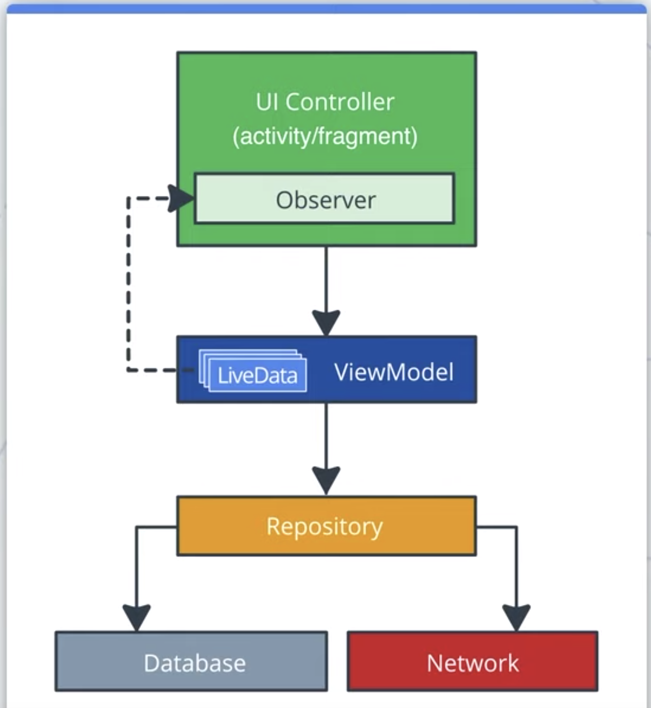
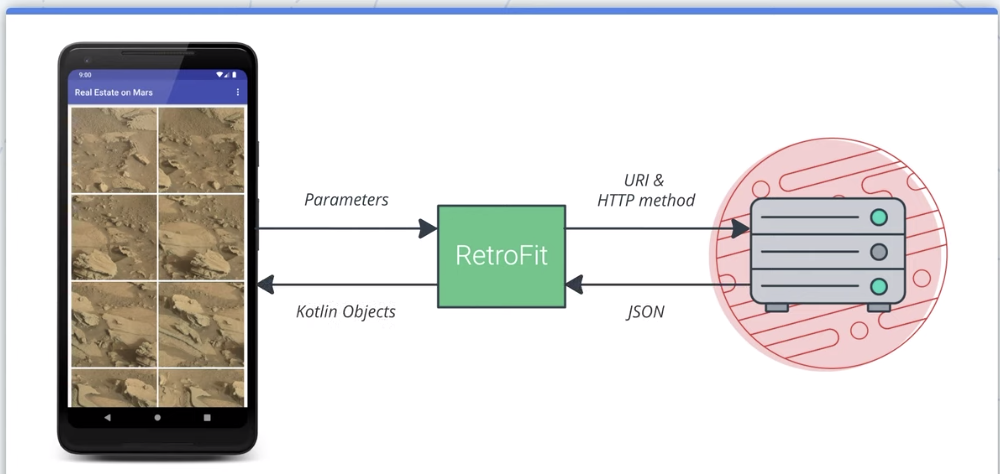
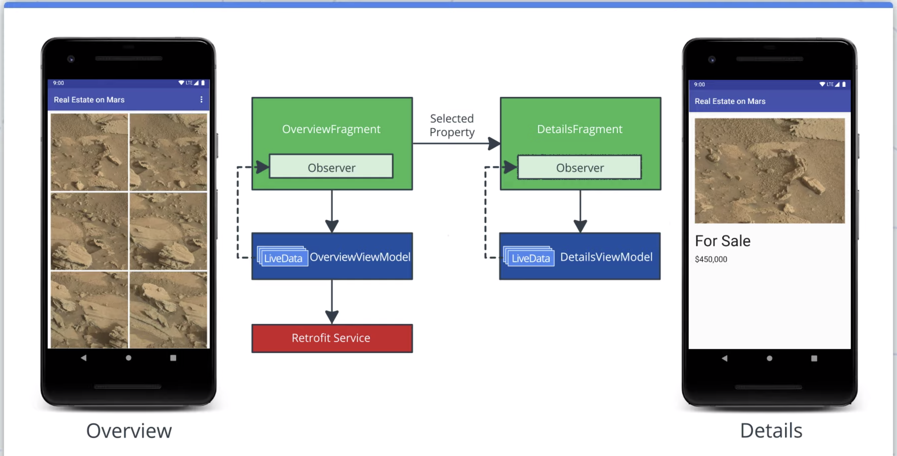
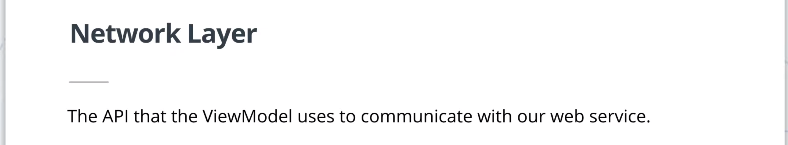

## 1. Greetings Earth Friends!

## 2. Introduction



## 3. RESTful Services

URI가 URL을 포함하는 개념



## 4. Libraries

## 5. App Walkthrough and Starter Code



## 6. Exercise: Connecting to the Internet



## 7. Permissions

## 8. Exercise: Parsing the JSON Response

### moshi가 gson이나 jackson보다 더 좋은 이유가 있을까?

[https://medium.com/@IlyaEremin/android-json-parsers-comparison-2017-8b5221721e31](https://medium.com/@IlyaEremin/android-json-parsers-comparison-2017-8b5221721e31)

jackson이 성능에서 가장 좋은데 친숙하지 않은 API가 단점이라고 함.

moshi는 제이크 와튼이 만든 거라 함께 사용한 듯

## 9. Exercise: Coroutines and Deferred

    Deferred<List<MarsProperty>>
    
    ...
    
    private fun getMarsRealEstateProperties() {
       coroutineScope.launch {
           var getPropertiesDeferred = MarsApi.retrofitService.getProperties()
           try {
                var listResult = getPropertiesDeferred.await() // retrofit에 suspend기능의 메소드가 추가됨.
               _response.value = "Success: ${listResult.size} Mars properties retrieved"
           } catch (e: Exception) {
               _response.value = "Failure: ${e.message}"
           }
       }
    }
    
** 현재 19년 6월 Retrofit에서 coroutine의 suspend를 직접 지원
https://github.com/square/retrofit/blob/master/CHANGELOG.md#version-260-2019-06-05
```kotlin
@GET("users/{id}")
suspend fun user(@Path("id") id: Long): User
```

## 10. Googler Interview: Jake Wharton

## 11. Exercise: Display an Internet Image

## 12. Exercise: Display Images in a Grid

ViewModel의 LiveData<List<dataItem>> → layout xml의 바인딩 어댑터로 적용

## 13. Exercise: Error Handling with RecyclerView

## 14. Parcel and Parcelables

코틀린에서 @Parcelize 어노테이션이면 Parcelable 완성

## 15. Exercise: Add the Detail Screen

## 16. Summary
